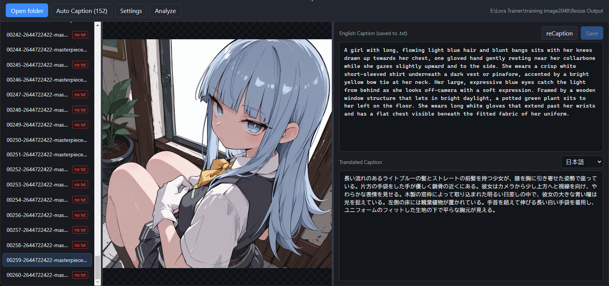
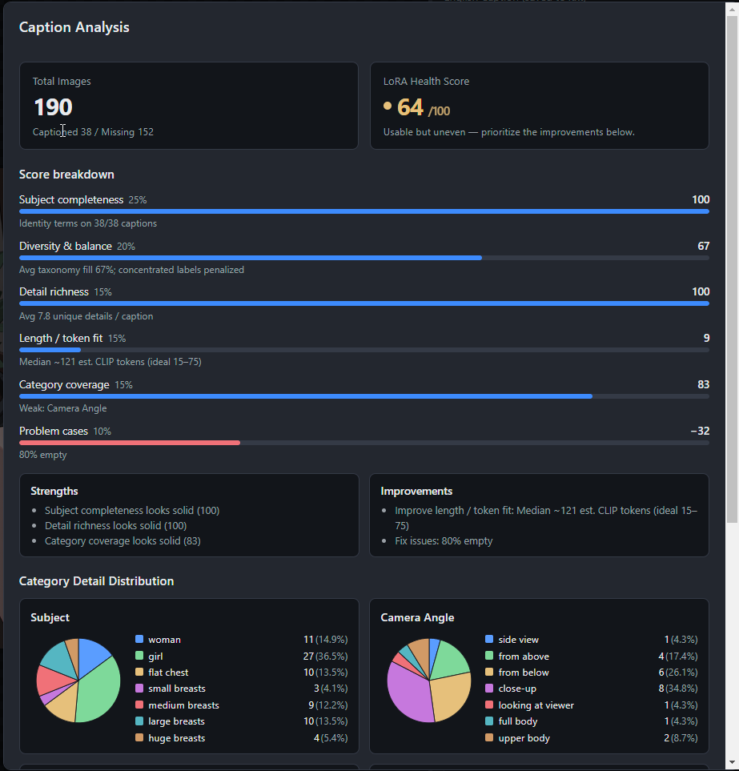

# Captioer

**LoRA training image caption editor** — browse datasets, edit English captions, bidirectional translate with a local LLM (LM Studio / Ollama), batch Auto Caption, and analyze dataset health.

## Screenshots

### Full window

<p align="center">
  
</p>

### Caption Analysis Page

<p align="center">
  
</p>

---

## Features

- **Folder browser**: open a training-image folder — list on the left, preview in the center, editor on the right
- **English caption editing**: save as a sidecar `.txt` with the same name as the image (standard LoRA / caption workflow)
- **Bidirectional translation**: English (top) ↔ target language (bottom, Traditional Chinese by default); edits on either side stay in sync
- **Auto Caption / reCaption**: generate captions with a local vision/LLM and custom prompts (PNG Info is appended at runtime)
- **Caption Analysis**: caption coverage, LoRA Health Score, and per-category detail distributions (pie charts)
- **Resizable layout**: drag splitters to resize panes; window position is remembered

---

## Requirements

| Item | Notes |
|------|--------|
| OS | Windows x64 (packaged with `electron-builder --win`) |
| Development | Node.js 18+ |
| AI backend (optional) | [LM Studio](https://lmstudio.ai/) or [Ollama](https://ollama.com/), reachable on localhost |

You can still edit and save captions without an AI backend. Translation, Auto Caption, and Analyze require a running model service.

---

## Quick start

### Run from source

```bash
npm install
npm run dev
```

### Build Windows portable

```bash
npm run dist
```

Output: `release/Captioer-0.1.0-portable.exe`

---

## Dataset layout

Each image pairs with a same-named caption file:

```text
my-dataset/
  img_001.png
  img_001.txt          ← English caption (read/written by this app)
  img_002.jpg
  img_002.txt
  …
```

Supported image extensions: `.jpg` / `.jpeg` / `.png` / `.webp` / `.bmp` / `.gif`.

---

## How to use

### 1. Open a dataset

1. Click **Open folder** in the toolbar
2. Select a folder that contains images
3. The left list shows images (with / without `.txt` is indicated)

### 2. Edit and save captions

1. Select an image in the list; the center pane shows the preview
2. Edit text in **English Caption** on the right
3. Click **Save**, or press `Ctrl+S`, to write the sidecar `.txt`
4. Unsaved work shows **Unsaved** in the toolbar; you can save or discard when switching images

### 3. Bidirectional translation

1. Open **Settings**, choose LM Studio or Ollama, Base URL, and Model, then **Test connection**
2. Pick the target language in the lower pane (Traditional/Simplified Chinese, Japanese, Korean, European languages, etc.)
3. Existing English captions are translated automatically
4. Edit the translation pane to back-translate and update the English caption (useful for drafting in your native language)

### 4. Settings (connection & caption prompt)

In **Settings** you can configure:

- **Translation provider**: LM Studio / Ollama
- **Base URL** (defaults: LM Studio `http://localhost:1234/v1`, Ollama `http://localhost:11434`)
- **Model**: auto-detected list, with Refresh
- **Auto Caption prompt**: multiple presets (name + prompt); PNG Info is appended at runtime

The same model is used for translation, Auto Caption, reCaption, and Analyze.

### 5. Auto Caption / reCaption

**Auto Caption**

- Only processes images that do not yet have a `.txt`
- The button shows the pending count, e.g. `Auto Caption (12)`
- While running, use **Cancel Auto Caption**

**reCaption**

- Regenerates the caption for the currently selected image (overwrites and saves)

Before running, confirm the model and prompt preset in Settings, and that your backend has loaded a vision-capable model (depending on your LM Studio / Ollama setup).

### 6. Caption Analysis

Click **Analyze** to:

1. Load all captions
2. Classify detail tags in each caption with AI
3. Show **Total Images**, **LoRA Health Score (/100)**, score breakdown, strengths / improvements
4. Draw per-category detail distributions (Subject, Camera, Clothing, …)

Use this to check dataset diversity and whether captions are skewed.

---

## Keyboard shortcuts

| Shortcut | Action |
|----------|--------|
| `Ctrl+S` | Save the current English caption |
| `↑` / `←` | Previous image (when focus is not in an input) |
| `↓` / `→` | Next image |
| `Delete` | Delete the current image and its caption (confirmation required) |

---

## Suggested workflow

1. Put training images in one folder  
2. **Settings** → connect LM Studio / Ollama → pick model and caption preset  
3. **Auto Caption** to fill missing `.txt` files  
4. Review / refine via the translation pane, then save English  
5. **Analyze** for Health Score and category balance; **reCaption** or edit by hand as needed  
6. Point your LoRA training script / GUI at the folder  

---

## Development commands

| Command | Description |
|---------|-------------|
| `npm run dev` | Development mode |
| `npm run build` | Compile |
| `npm run preview` | Preview the production build |
| `npm run typecheck` | TypeScript check |
| `npm run dist` | Package Windows portable |

Stack: Electron + React + TypeScript (electron-vite).

---

## License

If no license file is present, check the repository license or the author’s statement before use.
